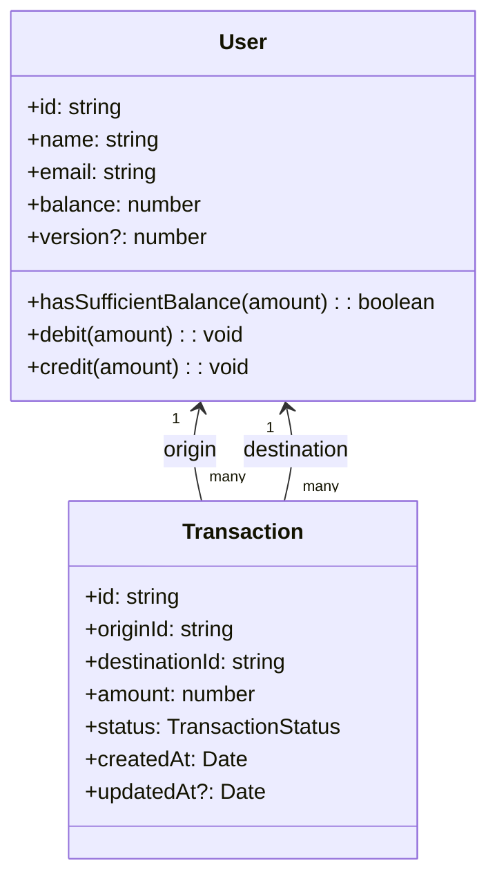
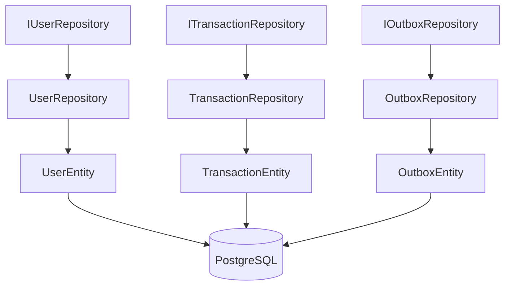
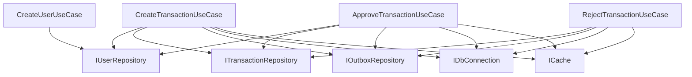
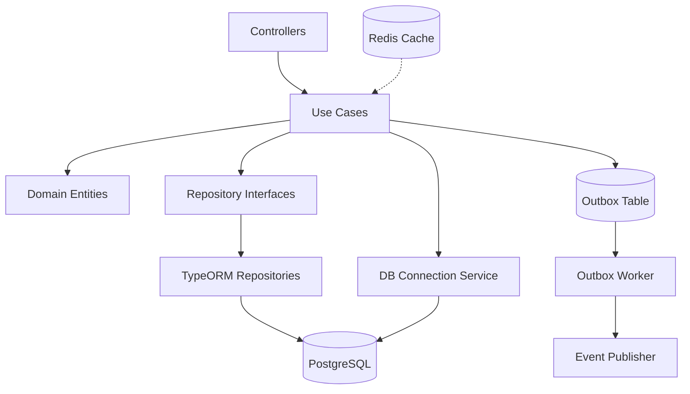
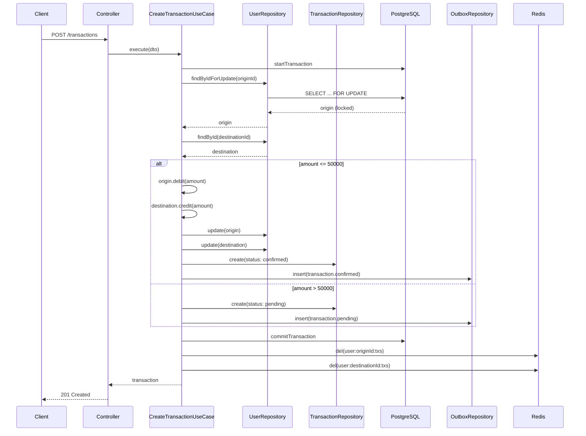
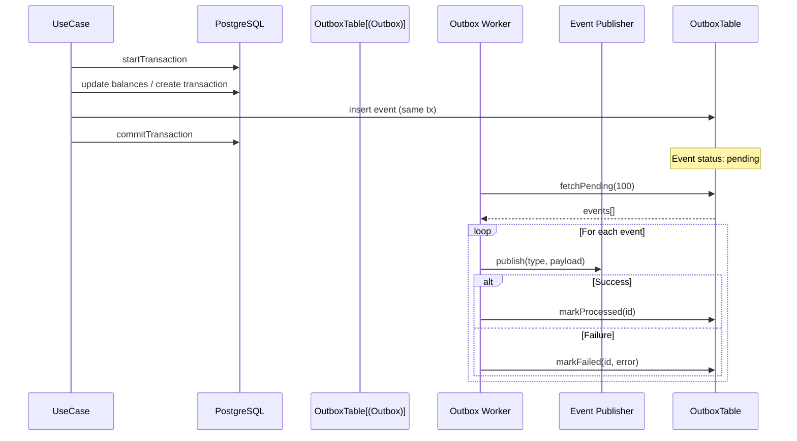

# Mini Plataforma Fintech — Architecture.md

## Propósito

Este documento describe las decisiones arquitecturales, estructura del proyecto, patrones implementados y reglas de desarrollo para la mini plataforma fintech.

## Resumen de la solución

Stack tecnológico:
- **Node.js + NestJS** (TypeScript) como framework backend
- **PostgreSQL** como base de datos transaccional
- **TypeORM** como ORM para persistencia
- **Redis** para cache de consultas
- **Jest** para testing

Patrones arquitecturales:
- **Clean Architecture / Hexagonal**: separación de capas (controllers → application → domain → infrastructure)
- **DDD**: entidades de dominio y use-cases que encapsulan lógica de negocio
- **Outbox Pattern**: para integración asíncrona y eventos
- **Repository Pattern**: abstracción de persistencia
- **Unit of Work**: manejo transaccional en operaciones críticas

## Capas y responsabilidades

### Controllers (adapters)
- `controllers/transactions.controller.ts`: convierte requests HTTP a DTOs y llama a use-cases de transacciones
- `controllers/users.controller.ts`: expone endpoints para crear usuarios sin depender solo del seed
- Sin lógica de negocio, solo validación de entrada y transformación de salida

### Application (use-cases)
- `application/use-cases/create-transaction.usecase.ts`: crea transacciones y aplica reglas de negocio
- `application/use-cases/approve-transaction.usecase.ts`: aprueba transacciones pendientes
- `application/use-cases/reject-transaction.usecase.ts`: rechaza transacciones pendientes
- `application/use-cases/list-transactions.usecase.ts`: lista transacciones de un usuario
- `application/use-cases/create-user.usecase.ts`: crea usuarios a partir de `CreateUserDTO`

Cada use-case:
- Orquesta la lógica de negocio
- Valida reglas del dominio
- Coordina repositorios y servicios
- Maneja transacciones de base de datos

### Domain
- `domain/entities/user.entity.ts`: entidad User con métodos de negocio (debit, credit)
- `domain/entities/transaction.entity.ts`: entidad Transaction con estados y validaciones
- `domain/exceptions/domain.exceptions.ts`: excepciones específicas del dominio
- `domain/ports/`: interfaces de repositorios (IUserRepository, ITransactionRepository, IOutboxRepository)

#### Diagrama de dominio



### Infrastructure
- `infrastructure/persistence/typeorm/`: implementaciones concretas de repositorios
  - `repositories/user.repository.ts`: implementa IUserRepository con TypeORM
  - `repositories/transaction.repository.ts`: implementa ITransactionRepository
  - `repositories/outbox.repository.ts`: implementa IOutboxRepository
  - `entities/`: entidades de TypeORM (UserEntity, TransactionEntity, OutboxEntity)
- `infrastructure/cache/redis-cache.service.ts`: implementación de cache con Redis
- `infrastructure/persistence/typeorm/db-connection.service.ts`: servicio para manejo de transacciones

#### Diagrama de infraestructura (repositorios)



### Shared
- `shared/dto/`: DTOs para validación de entrada
- `shared/repositories/abstract-identity.repository.ts`: clase abstracta base para repositorios de identidades
- `shared/db/db-connection.interface.ts`: interfaz para manejo de transacciones
- `shared/cache/cache.interface.ts`: interfaz para cache
- `shared/errors/error-codes.ts`: diccionario de códigos de error de negocio/técnicos
- `shared/filters/global-exception.filter.ts`: filtro global que mapea excepciones a respuestas HTTP con códigos de error

#### Diagrama de aplicación (use-cases y puertos)



## Repositorios y abstracciones

### Interfaces de dominio
- `IUserRepository`: contrato para operaciones sobre usuarios
  - `findById(id)`: busca usuario por ID
  - `findByIdForUpdate(id, queryRunner)`: busca con lock pesimista para evitar race conditions
  - `create(user, queryRunner?)`: crea usuario
  - `update(user, queryRunner?)`: actualiza usuario
- `ITransactionRepository`: contrato para operaciones sobre transacciones
- `IOutboxRepository`: contrato para eventos outbox

### AbstractIdentityRepository
Clase abstracta base que puede extenderse para crear repositorios de identidades con funcionalidad común:
- Métodos básicos: findById, create, update, delete
- Hooks opcionales: beforeCreate, afterCreate

## Transacciones y concurrencia

### Estrategia de transacciones
Todas las operaciones que modifican saldos se ejecutan dentro de transacciones ACID de PostgreSQL.

### Control de concurrencia
Para prevenir race conditions en operaciones de débito simultáneas:

**Estrategia implementada: Pessimistic Locking con `SELECT FOR UPDATE`**

En `CreateTransactionUseCase` y `ApproveTransactionUseCase`:
1. Se inicia una transacción
2. Se obtiene el usuario origen con `findByIdForUpdate()` que ejecuta `SELECT ... FOR UPDATE`
3. Esto bloquea la fila hasta que la transacción se complete
4. Se valida saldo y se realiza el débito/crédito
5. Se confirma la transacción

**Alternativa considerada: Optimistic Locking**
- Usar columna `version` en tabla users
- Verificar versión antes de actualizar
- Lanzar error si versión cambió (otra transacción modificó el registro)
- No implementada pero la estructura está preparada (columna version existe)

### Atomicidad
Las operaciones de débito y crédito se ejecutan en la misma transacción:
- Si falla cualquier paso, se hace rollback completo
- No puede quedar saldo negativo por operaciones parciales

## Outbox Pattern

### Propósito
Garantizar que eventos se publiquen de forma confiable después de que la transacción de negocio se complete.

### Implementación
1. **Tabla outbox**: almacena eventos pendientes
   - `id`: UUID generado
   - `aggregateId`: ID de la entidad relacionada (transaction.id)
   - `type`: tipo de evento (transaction.confirmed, transaction.pending, transaction.rejected)
   - `payload`: JSON con datos del evento
   - `status`: pending | processed | failed
   - `createdAt`, `processedAt`, `error`

2. **Inserción en misma transacción**: cuando se crea/confirma/rechaza una transacción, se inserta el evento en outbox dentro de la misma transacción DB

3. **Worker**: `workers/outbox.worker.ts` lee eventos pendientes y los publica
   - Ejecuta cada 5 segundos
   - Procesa hasta 100 eventos por batch
   - Marca como processed o failed según resultado

### Uso
- Eventos se insertan automáticamente en use-cases cuando hay cambios de estado
- Worker puede extenderse para publicar a Kafka, RabbitMQ, o hacer HTTP calls

## Cache (Redis)

### Estrategia
- Cachear respuestas de consultas no críticas:
  - `GET /transactions?userId=...`: lista de transacciones (TTL: 60s)
  - Perfiles de usuario (no implementado pero estructura lista)

### Invalidación
Cache se invalida cuando:
- Se crea una transacción (afecta a origin y destination)
- Se aprueba una transacción (afecta a origin y destination)
- Se rechaza una transacción (afecta a origin y destination)

Claves de cache:
- `user:{userId}:txs`: lista de transacciones
- `user:{userId}`: perfil de usuario (futuro)

### Tolerancia a fallos
Si Redis no está disponible, las operaciones continúan sin cache (fail-silent).

## API / Documentación

### Swagger/OpenAPI
- Disponible en `/api-docs` cuando la aplicación está corriendo
- Documenta todos los endpoints con ejemplos

### Postman Collection
- `postman_collection.json`: collection completa para importar en Postman
- Incluye todos los endpoints con ejemplos

### cURL
- `curls.json`: array con comandos cURL listos para usar

## Tests

### Estrategia
- **Tests unitarios**: use-cases con repositorios mockeados
  - Foco en reglas de negocio
  - Validaciones, excepciones, flujos exitosos
  - Archivos: `create-transaction.usecase.spec.ts`, `approve-transaction.usecase.spec.ts`

- **Validación end-to-end manual**:
  - cURL para probar endpoints (`CURL_COMMANDS.md`)
  - SQL para validar saldos, estados y outbox (`SQL_VALIDATION.md`)

- **Tests de controladores**: no se incluyen; la lógica de negocio vive en use-cases

## Observabilidad y logs

### Logs estructurados
- Logs en formato texto simple para desarrollo
- Worker de outbox loguea eventos procesados/fallidos

### Trace ID
- No implementado pero estructura lista para agregar middleware de trace ID

## Scripts y despliegue local

### Docker Compose
```bash
docker-compose up -d
```
Levanta PostgreSQL y Redis.

### Scripts npm/yarn
- `yarn start`: inicia la aplicación (NestJS con ts-node)
- `yarn start:dev`: inicia aplicación en modo desarrollo
- `yarn migrate`: ejecuta migraciones
- `yarn seed`: crea datos de prueba (3 usuarios)
- `yarn test`: ejecuta tests unitarios de casos de uso
- `yarn outbox:worker`: inicia worker de outbox
- `yarn ci`: lint + tests + build

## Decisiones y trade-offs

### Decisiones tomadas
1. **Pessimistic locking sobre optimistic**: más simple y garantiza consistencia fuerte
2. **TypeORM sobre Prisma**: mejor integración con NestJS y transacciones
3. **Redis opcional**: aplicación funciona sin Redis (cache es opcional)
4. **Outbox simple**: worker básico, extensible a pub/sub real

### Trade-offs
- **Consistencia vs Performance**: priorizamos consistencia (transacciones ACID)
- **Simplicidad vs Complejidad**: outbox y cache son opcionales, no bloquean funcionalidad core
- **Tests**: foco en use-cases, no en controllers (evita over-testing)

## Convenciones de código

### Commits
Formato: `tipo(scope): descripción`
- `feat(transactions): add CreateTransaction use-case`
- `test(transactions): add create transaction integration test`
- `fix(transactions): fix concurrent debit race condition`

### Comentarios
- Comentarios mínimos y técnicos
- Solo cuando agregan valor real
- Evitar comentarios obvios

### Nombres
- Funciones y clases: descriptivos y expresivos
- Variables: claras sobre su propósito
- Interfaces: prefijo `I` (IUserRepository)

## Diagramas

### Arquitectura general



### Flujo POST /transactions



### Outbox Pattern



## Estructura de directorios

```
src/
├── controllers/
│   └── transactions.controller.ts
├── application/
│   └── use-cases/
│       ├── create-transaction.usecase.ts
│       ├── approve-transaction.usecase.ts
│       ├── reject-transaction.usecase.ts
│       └── list-transactions.usecase.ts
├── domain/
│   ├── entities/
│   │   ├── user.entity.ts
│   │   └── transaction.entity.ts
│   ├── exceptions/
│   │   └── domain.exceptions.ts
│   └── ports/
│       ├── user-repository.interface.ts
│       ├── transaction-repository.interface.ts
│       └── outbox-repository.interface.ts
├── infrastructure/
│   ├── persistence/
│   │   └── typeorm/
│   │       ├── entities/
│   │       ├── repositories/
│   │       ├── migrations/
│   │       ├── data-source.ts
│   │       └── db-connection.service.ts
│   └── cache/
│       └── redis-cache.service.ts
├── shared/
│   ├── dto/
│   ├── repositories/
│   ├── db/
│   └── cache/
├── workers/
│   └── outbox.worker.ts
├── app.module.ts
└── main.ts
```

